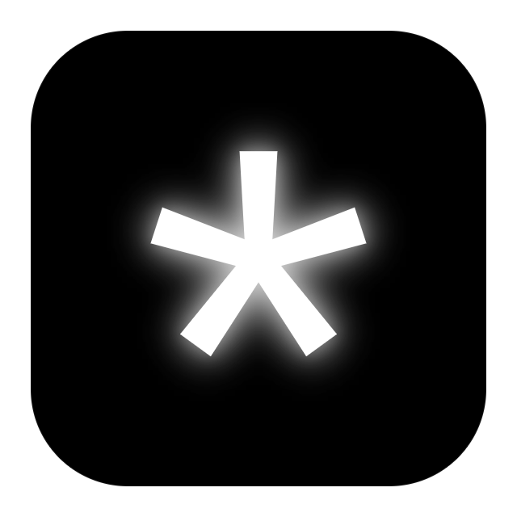

<p align="center">
  
</p>

<h1 align="center">Neuron</h1>

<p align="center">
  A local-first Markdown and MDX workspace for writing, linking, and extending your notes.
</p>

<p align="center">
  <a href="#download">Download</a> ·
  <a href="docs/development.md">Development</a> ·
  <a href="docs/architecture.md">Architecture</a> ·
  <a href="docs/plugin-api.md">Plugin API</a> ·
  <a href="docs/distribution.md">Publishing</a>
</p>

## Why Neuron?

Neuron treats your notes as durable files, not records trapped in a hosted database. Open any folder of `.md` or `.mdx` documents and work with it as a focused desktop knowledge base — that folder is your workspace. It can stay offline, live in Git, or sync through a folder service you already use (OneDrive, Google Drive, Dropbox). You can keep several workspaces and switch between them from the title bar.

### Highlights

- Live Markdown editing with source, split-preview, and reading modes.
- Multiple note tabs, task checkboxes, tables, code blocks, wiki-links, and tags.
- Resizable, VS Code-style docks — drag any divider; layout persists.
- **HTMX views (`.nhtml`)** — build custom local dashboards and tools from plain HTML + [htmx](https://htmx.org), rendered in a sandboxed webview against a capability-scoped workspace API. Bundled htmx, so they work offline; permissions and variables live in an inspectable `.neuron` folder.
- JSON Canvas (`.canvas`) boards — an infinite spatial whiteboard (Obsidian-compatible) with undo/redo, multi-select, alignment, Markdown cards, and per-node styling.
- Notion-style `.db` databases — typed properties, colored select tags, filtering and sorting — stored as plain JSON in the workspace with atomic writes and live reload on external changes.
- Built-in plugin host with commands, MDX components, side peeks, and bottom peeks.
- Optional AI integrations for OpenAI, Anthropic, Gemini, OpenRouter, and local endpoints.
- Full interactive terminal (PTY) and saved command automations for workspace-aware command-line work.
- Graphite, Void, Nord, and Light themes with configurable Markdown colors.
- Local settings and ordinary files; no Neuron account or hosted backend required.

## Download

Installers are published on the repository's **Releases** page. The companion GitHub Pages site always links to the newest release.

| Platform | Release formats |
| --- | --- |
| Windows | NSIS installer and portable executable |
| macOS | DMG and ZIP for Intel and Apple silicon |
| Linux | AppImage and Debian package |

> Release builds are currently unsigned. Windows SmartScreen and macOS Gatekeeper may display a warning until signing certificates and notarization are configured. Do not disable operating-system protections globally.

## Quick start from source

### Prerequisites

- Node.js 20 or newer
- npm 10 or newer
- Git

```bash
git clone https://github.com/YOUR_ACCOUNT/Neuron.git
cd Neuron
npm ci
npm run dev
```

`npm run dev` starts Vite, watches the Electron main process, waits for both to become ready, and then opens the desktop app.

### Build commands

```bash
npm run build          # Clean previous output, then compile main + renderer
npm run dist:test      # Create a local beta installer named Neuron Test
npm run release        # Build and publish the production NSIS installer
npm run icon:generate  # Regenerate build/icon.png from build/icon.svg
```

Generated output is written to `dist/` and `release/`; both directories are cleared at the start of each build and ignored by Git. Test installers go to `release/test/` and production installers go to `release/prod/`.

## Data and privacy

- Notes remain in the folder you choose.
- Neuron does not upload workspaces or require an account.
- Network requests occur only when you explicitly use a network-backed plugin.
- Plugin credentials and settings are stored in Electron's local user-data directory.
- The renderer runs with context isolation enabled and Node integration disabled.

Review [the architecture](docs/architecture.md) for process boundaries and [the security policy](.github/SECURITY.md) for vulnerability reporting.

## Documentation

| Document | Purpose |
| --- | --- |
| [Development guide](docs/development.md) | Setup, commands, debugging, testing, and project layout |
| [Architecture](docs/architecture.md) | Electron processes, storage, editor, rendering, and plugin boundaries |
| [Plugin API](docs/plugin-api.md) | Manifests, panels, commands, runtime capabilities, and examples |
| [Distribution](docs/distribution.md) | GitHub Actions, Releases, Pages, signing, and release checklist |
| [Product brief](docs/product.md) | Audience, goals, constraints, and product principles |
| [Design system](docs/design-system.md) | Visual tokens, components, motion, and accessibility |
| [Troubleshooting](docs/troubleshooting.md) | Common development, packaging, and release problems |

## Repository layout

```text
.github/          CI, release, Pages, contribution, and security files
build/            Canonical desktop icon source and generated PNG
docs/             Public documentation and GitHub Pages site
examples/         Demo note repository bundled with the application
public/           Renderer assets copied by Vite
src/main/         Electron main process and secure preload bridge
src/renderer/     React workspace, editor, previews, and plugin host
tools/            Development and asset-maintenance utilities
```

## Contributing

Bug reports, documentation improvements, and focused pull requests are welcome. Read [.github/CONTRIBUTING.md](.github/CONTRIBUTING.md) before contributing. Please use private vulnerability reporting for security issues.

## Project status

Neuron is under active development. Back up important notes and review release notes before upgrading. The file format is plain Markdown/MDX, so workspaces remain usable without Neuron.

## License

Neuron is available under the [MIT License](LICENSE).
